# DSAL_HUST_project
Link video:  

### Book Library Management 📖
# Why use Linked List instead of Array
1. Dynamic Size
2. No wasted space

Drawbacks: More difficult to implement than Array 

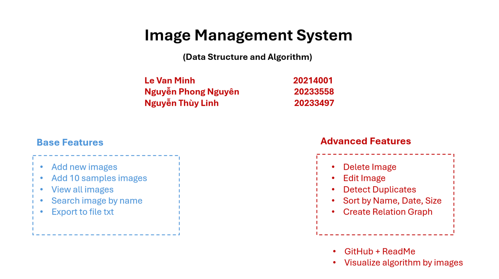

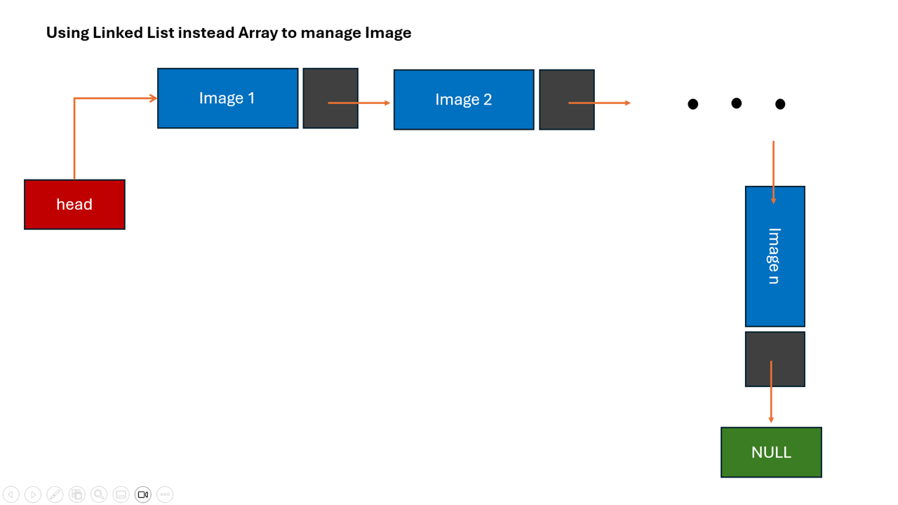

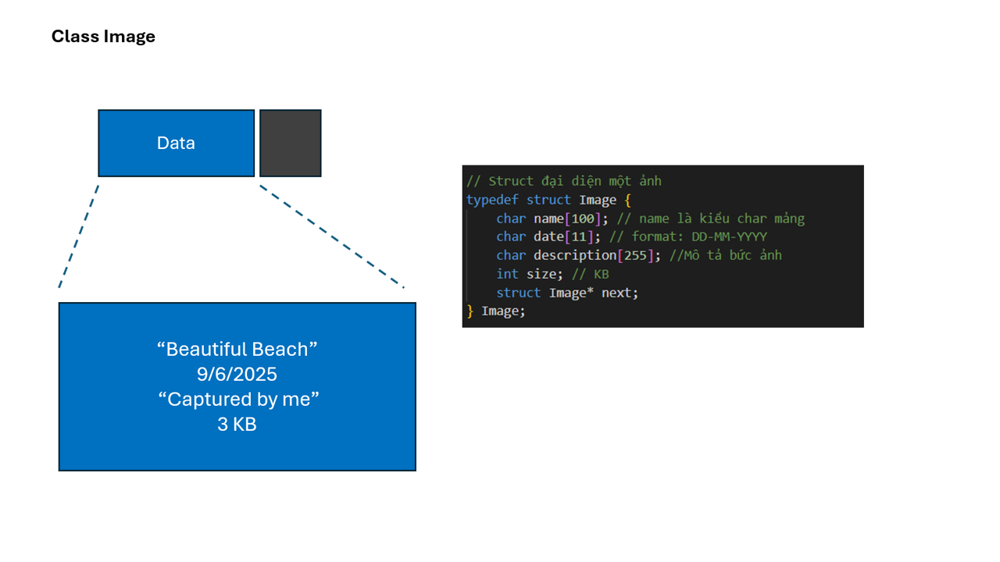

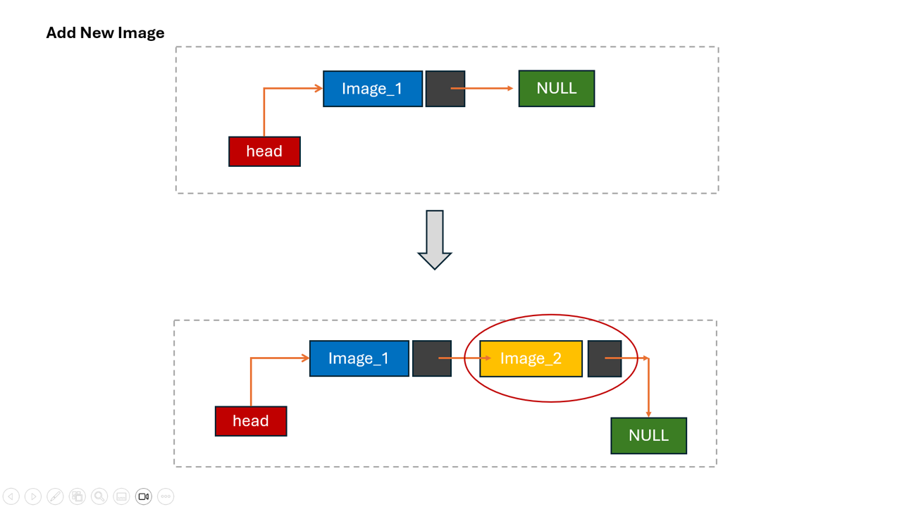

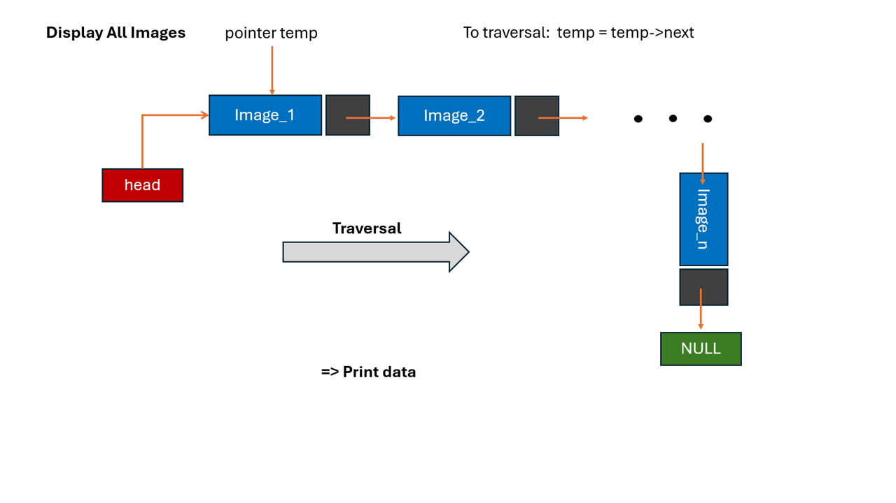

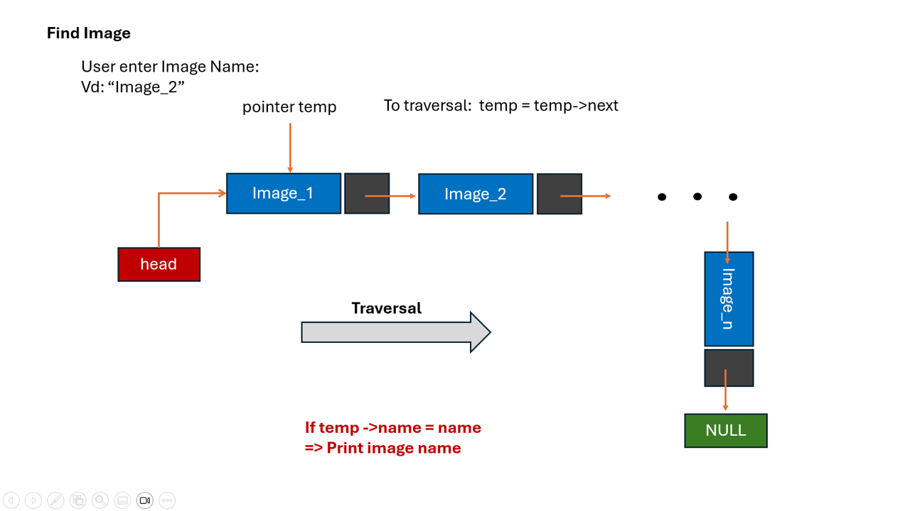

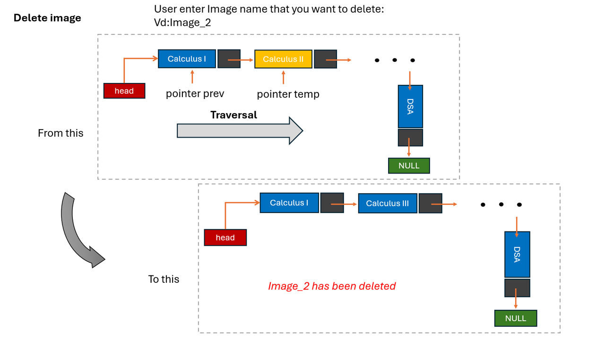

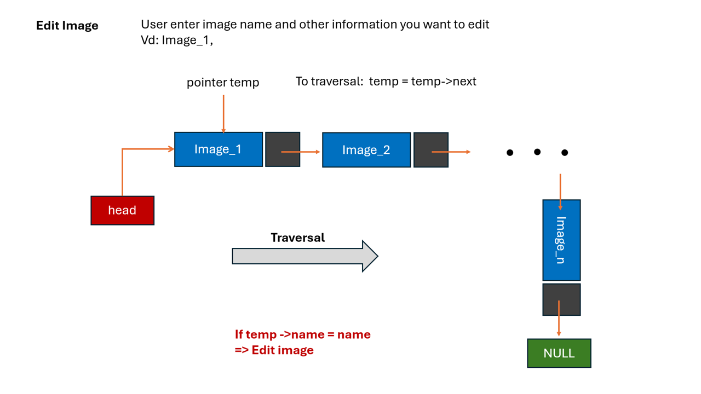

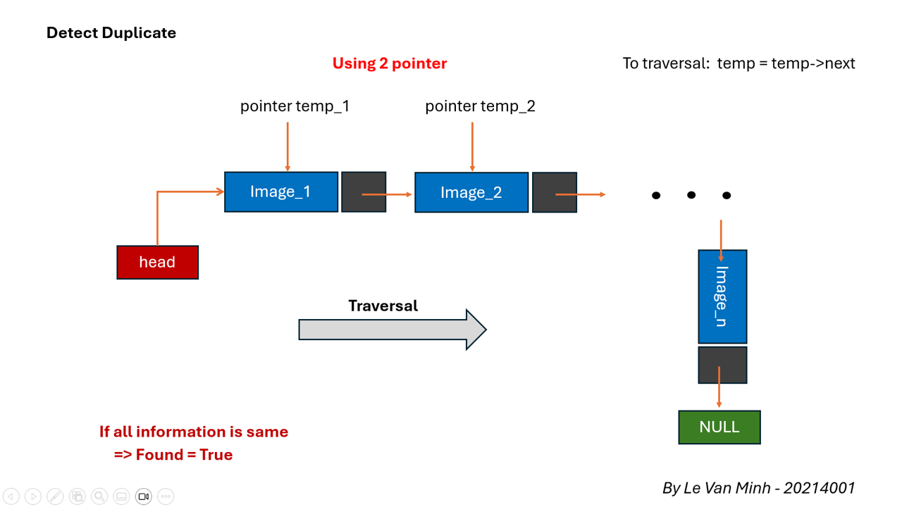

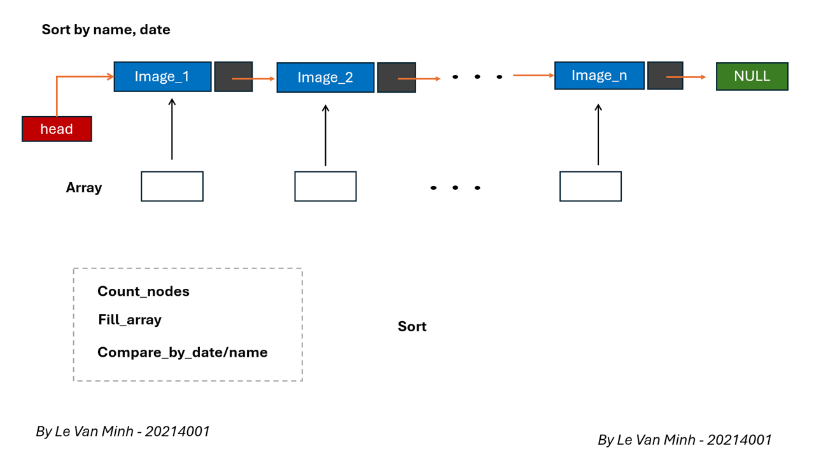

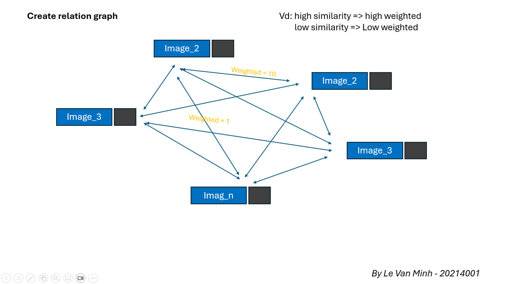
